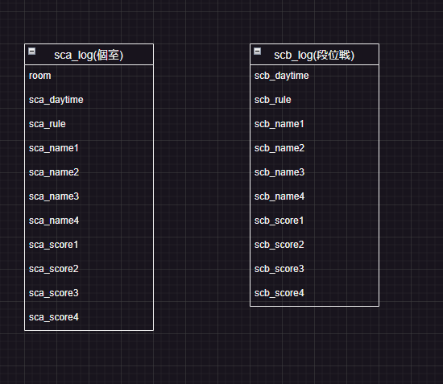
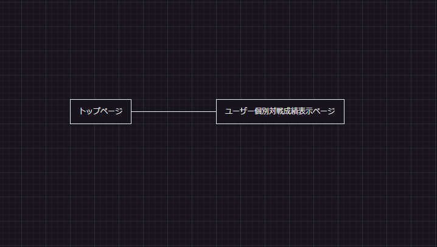

# アプリケーション名

tenho-sokai

# アプリケーション概要

麻雀アプリの天鳳の対戦記録をグラフを用いながら特に推移を分かりやすく表示する。

# 利用方法

## ユーザー名検索
1.トップページのフォームから自分のユーザー名を検索する
2.名前があれば表示されクリックをして対戦成績表示ページに遷移する。

##  対戦成績の表示
1.過去の麻雀アプリの天鳳の対戦記録を自分のだけピックアップして見ることができる。
2.グラフを用いて視覚的に見やすくして特に線グラフを用いて成績の推移を分かりやすく表示する。
# アプリケーションを作成した背景
既存のアプリを見てほとんどcssを使っておらず文字が積み木のように並んでおりどこに何があるか感覚的に分かりづらいと感じた。よってグラフを用いた感覚的に分かりやすい見た目のアプリを開発した。

# 洗い出した要件
https://docs.google.com/document/d/1jTrGc1OLRQ_DaneQ8I6Ckl43pUPIzN82sWkqUTss9Dg/edit

# 実装予定の機能（都度更新）
https://docs.google.com/spreadsheets/d/1P6NwS7VVeBjRvqtEiTgiN8hifsNGzQgOn_mDL-h2_DM/edit#gid=0
# DB設計

# 画面遷移図

